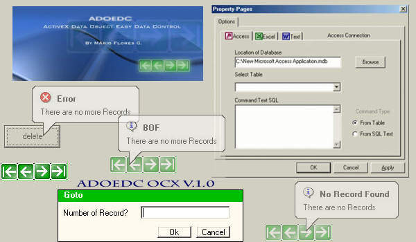



## ADOEDC OCX v1\.0\.3 \(updated  OCX\)

### Description

ActiveX Data Object Easy Data Control Ocx V1.0.3 is a more Graphical and Easy ADO designed for Total Beginners,but it also can be used by anyone,Forget Newbies Database errors,and hard to understand code,this New Ado works like the Regular Ado but is more easy to use if you don't have any Databases experience..This Ado uses a Smart Property Page that lets you select from your *.MDB *.XLS *.TXT Databases and All this More Quickly..Now you can use Tables in Text Files,and of course Excel and Access Databases..

This Proyect includes a Tutorial for a more easy undestanding...

I used NWIND.MDB For Access Examples so check your NWIND location I used:

C:\Program Files\Microsoft Visual Studio\VB98

enjoy!!!!!

PLEASE REMEMBER TO VOTE!!!!!

Updated a Free OCX..only compiled code!! but still more to come (this is yust part of the actual ADOEDC PRO OCX)this free version can have some bugs and some features are not ready.. but is still a great utility for Visual Basic Programers.

The ADOEDC Control is an important developer tool in Visual Basic and it's worth getting a closer look at it here.

----

http://geocities.com/marioflores_code

----

or download zip from:

http://geocities.com/marioflores_code/adoedc.zip

;)
 
### More Info
 

             |
---                |---
**Submitted On**   |2003-05-01 00:32:36
**By**             |[MArio Flores G](https://github.com/Planet-Source-Code/PSCIndex/blob/master/ByAuthor/mario-flores-g.md)
**Level**          |Beginner
**User Rating**    |4.9 (122 globes from 25 users)
**Compatibility**  |VB 6\.0, VB Script, ASP \(Active Server Pages\) 
**Category**       |[Databases/ Data Access/ DAO/ ADO](https://github.com/Planet-Source-Code/PSCIndex/blob/master/ByCategory/databases-data-access-dao-ado__1-6.md)
**World**          |[Visual Basic](https://github.com/Planet-Source-Code/PSCIndex/blob/master/ByWorld/visual-basic.md)
**Archive File**   |[ADOEDC\_OCX158145512003\.zip](https://github.com/Planet-Source-Code/mario-flores-g-adoedc-ocx-v1-0-3-updated-ocx__1-45156/archive/master.zip)

